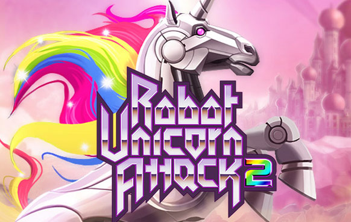

# Evergreen Awesome Hackathon: My Sample App

The purpose of this app is to provide an example of how to best format an app submission on [Github](http://github.com) for a hackathon. If you'd like to suggest changes or improvements to this example, feel free to send me a pull request.

This application was developed on February 5th, 2015 for the [Evergreen Awesome Hackthon](http://example.com/this-goes-nowhere).

You can also check out [this demo screencast](https://www.youtube.com/watch?v=dQw4w9WgXcQ) of our application on YouTube.

## Challenge and Approach

Our submission is for [Challenge #3: Build an app that provides an example of an Awesome Hackathon submission](http://example.com/this-also-goes-nowhere).

Our approach for satisfying this challenge was to:

- Develop an example Git repository
- Share it on Github
- Collect feedback from the community

Once we did that, we knew we were guaranteed to win!

## Team Members

Our team is comprised of:

- [@chrismetcalf](http://github.com/chrismetcalf) - README.md author and all around awesome guy
- [@torvalds](http://github.com/torvalds) - Wrangler of penguins
- [@matz](http://github.com/matz) - Miner of Rubies
- [@gvanrossum](http://github.com/gvanrossum) - Python charmer

## Technologies, APIs, and Datasets Utilized

We made use of:

- Hand harvested unicorn tears. Unicorns are very happy creatures, its hard to make them cry.
- [mod_bf](http://modbf.sourceforge.net/)
- The [Top 1,000 Songs To Hear Before You Die](https://opendata.socrata.com/Fun/Top-1-000-Songs-To-Hear-Before-You-Die/ed74-c6ni) dataset and [API](http://dev.socrata.com/foundry/#/opendata.socrata.com/ed74-c6ni)

## Contributing

In order to build and run our app:

1. Harvest yourself some unicorn tears. They're expensive to purchase on your own.
2. Deploy your the code to [Heroku](http://heroku.com)
3. Profit

Our code is licensed under the [MIT License](LICENSE.md) license. Pull requests will be accepted to this repo, pending review and approval.
